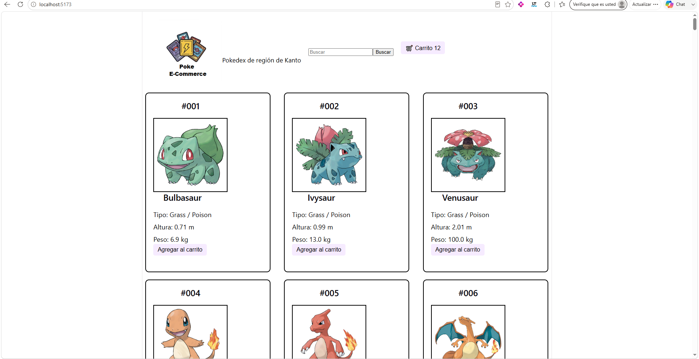
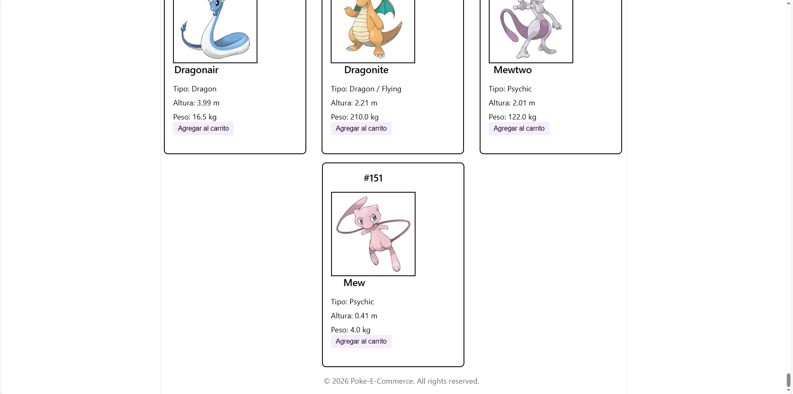

## Nombre del proyecto
 Poke-E-Commerce 

## Decripción del E-commerce
Este E-commerce tiene un fin evolutivo, como los pokemón. Actualmente se muestran los primeros 151 pokemones correspondientes a la region de Kanto. La información que se muestra es número de pokedex, imagen de pokemon, tipo,altura y peso. Esta lista se encuentra almacenada en un archivo json local. En un futuro se espera que se conecta a una api llamada pokeApi

## Componentes creados
Se generan un total de 5 componentes:
-button
-footer
-header
-productCard
searchBar

## Intrucciones para correr el proyecto
Para correr el proyecto de forma local se debe ejecutar el comando 'npm run dev'.

## Tecnologías usadas
npm
vite
react
html
css
javascript
## Capturas de pantalla 

